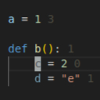

# End of Line Relative Line Numbers



Show Relative Line Numbers at the end of the line

Install from the [Visual Code Code Marketplace](https://marketplace.visualstudio.com/items?itemName=blake-scampone.end-of-line-relative-line-numbers)

## Settings

```jsonc
{
  "relative-line-endings": {
    // The color of the relative line numbers
    "color": "#75715E88",
    // Whether or not to hide the line number for the line that the cursor is on
    "hide-active-line": false,
    // Whether or not to hide the line number for empty lines
    "hide-empty-lines": true,
    // Whether or not to display the absolute or relative line number for the line that the cursor is on
    "use-absolute-active-line": false,
    // Used to specify the margin between the end of the line and the line number (interpreted as CSS margin)
    "margin": "0 0 0 2em",
    // Whether or not to add text before the line number (required for all 'prefix-*' settings to be active)
    "use-prefix": false,
    // The default text to add before the line number (will be used when 'prefix-*' settings are not set)
    "prefix-default": "",
    // The text to add before the line number, for lines above the cursor (overrides 'prefix-default')
    "prefix-above": null,
    // The text to add before the line number, for lines below the cursor (overrides 'prefix-default')
    "prefix-below": null,
    // The text to add before the line number, for the line of the cursor (overrides 'prefix-default')
    "prefix-current": null,
    // Whether or not to add text after the line number (required for all 'suffix-*' settings to be active)
    "use-suffix": false,
    // The default text to add after the line number (will be used when 'suffix-*' settings are not set)
    "suffix-default": "",
    // The text to add after the line number, for lines above the cursor (overrides 'suffix-default')
    "suffix-above": null,
    // The text to add after the line number, for lines below the cursor (overrides 'suffix-default')
    "suffix-below": null,
    // The text to add after the line number, for the line of the cursor (overrides 'suffix-default')
    "suffix-current": null
  }
}
```

## Development

Build Dependencies

```sh
npm install -g @vscode/vsce
npm install --save-dev @vscode/vsce
```

Rebuild

```sh
vsce package
```
